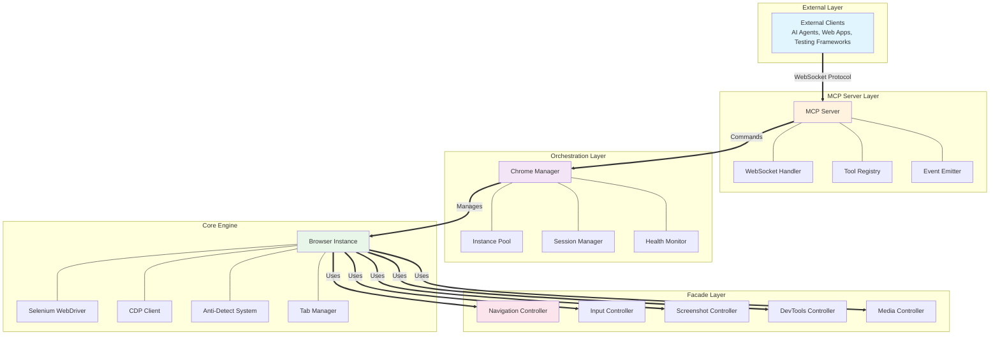
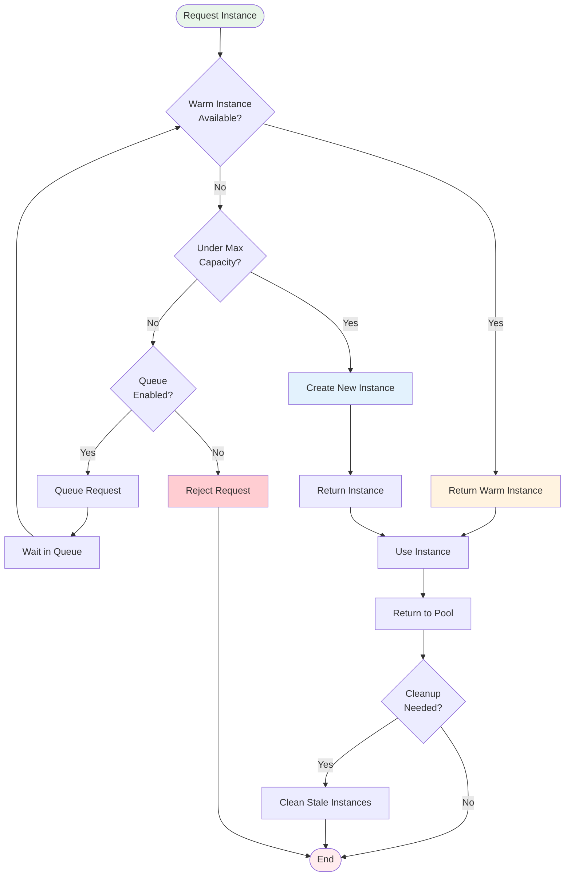
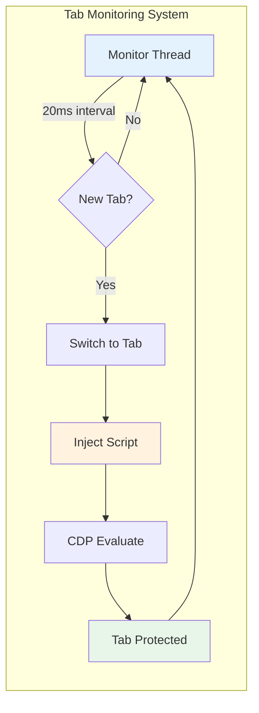
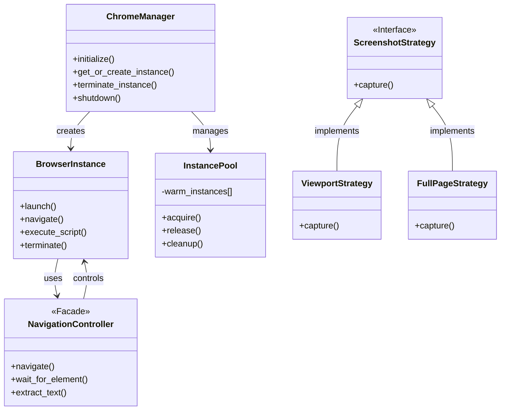
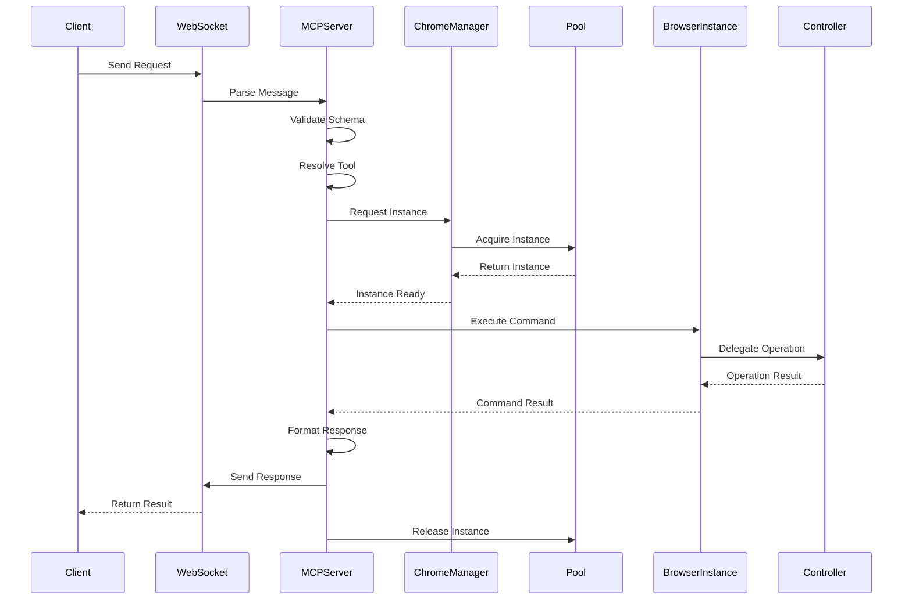
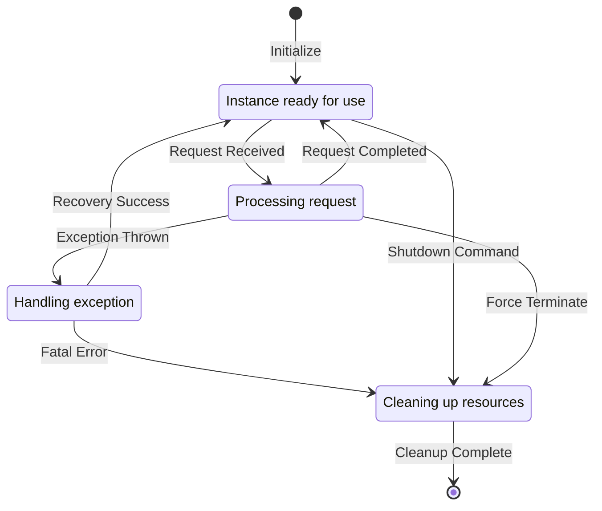

# 🏗️ AMI-WEB Architecture Documentation

## Table of Contents
1. [System Overview](#system-overview)
2. [Core Components](#core-components)
3. [Anti-Detection System](#anti-detection-system)
4. [MCP Server Protocol](#mcp-server-protocol)
5. [Design Patterns](#design-patterns)
6. [Data Flow](#data-flow)
7. [Security Architecture](#security-architecture)
8. [Performance Optimizations](#performance-optimizations)

## System Overview

AMI-WEB is a sophisticated Chrome automation platform built with a layered architecture that prioritizes:
- **Undetectability**: Advanced fingerprinting and anti-bot bypass techniques
- **Scalability**: Efficient resource pooling and async operations
- **Extensibility**: Plugin-based architecture with clear separation of concerns
- **Reliability**: Comprehensive error handling and retry mechanisms

### High-Level Architecture



## Core Components

### 1. Chrome Manager (`chrome_manager/core/manager.py`)

The central orchestrator that manages the lifecycle of browser instances.

**Responsibilities:**
- Instance pool management
- Resource allocation and deallocation
- Health monitoring and recovery
- Configuration management
- Metrics collection

**Key Methods:**
```python
async def initialize() -> None
async def get_or_create_instance(headless: bool, anti_detect: bool) -> BrowserInstance
async def return_to_pool(instance_id: str) -> bool
async def terminate_instance(instance_id: str) -> None
async def shutdown() -> None
```

### 2. Browser Instance (`chrome_manager/core/instance.py`)

Individual browser instance wrapper with anti-detection capabilities.

**Features:**
- Selenium WebDriver integration
- Chrome DevTools Protocol (CDP) support
- Anti-detection script injection
- Tab monitoring and management
- Graceful termination handling

**Lifecycle States:**
```python
class BrowserStatus(Enum):
    IDLE = "idle"
    BUSY = "busy"
    TERMINATED = "terminated"
    ERROR = "error"
```

### 3. Instance Pool (`chrome_manager/core/pool.py`)

Efficient resource pooling for browser instances.

**Pool Configuration:**
- **Min Instances**: Minimum instances to maintain
- **Max Instances**: Maximum concurrent instances
- **Warm Instances**: Pre-initialized instances ready for use
- **TTL**: Time-to-live for idle instances
- **Health Check Interval**: Periodic validation frequency

**Pool Algorithm:**



### 4. Facade Controllers

#### NavigationController (`chrome_manager/facade/navigation.py`)
- Page navigation with smart waiting
- Scroll control (smooth/instant)
- Element waiting strategies
- Storage operations (localStorage/sessionStorage)
- HTML extraction with depth limiting

#### InputController (`chrome_manager/facade/input.py`)
- Click simulation with retry logic
- Text input with human-like delays
- Keyboard shortcuts
- Drag and drop operations
- Form interactions

#### ScreenshotController (`chrome_manager/facade/media.py`)
- Full page capture
- Viewport screenshots
- Element-specific capture
- Base64 encoding
- Image optimization

#### DevToolsController (`chrome_manager/facade/devtools.py`)
- Console log capture
- Network monitoring
- Performance metrics
- Cookie management
- Cache control

## Anti-Detection System

### Overview

The anti-detection system is the crown jewel of AMI-WEB, making browser automation undetectable to even sophisticated bot detection systems.

### Implementation Layers

#### 1. Chrome Launch Arguments (`chrome_manager/core/antidetect.py`)
```python
--disable-blink-features=AutomationControlled
--exclude-switches=enable-automation
--user-agent=<realistic_user_agent>
--disable-web-security=false
--disable-features=IsolateOrigins,site-per-process
```

#### 2. JavaScript Injection (`chrome_manager/scripts/complete-antidetect.js`)

**Pre-Page Load Injection:**
- Executed via CDP `Page.addScriptToEvaluateOnNewDocument`
- Runs before any page scripts
- Modifies browser APIs before detection scripts load

**Key Modifications:**
```javascript
// Remove webdriver property
delete Object.getPrototypeOf(navigator).webdriver;

// Create realistic plugins
Object.defineProperty(navigator, 'plugins', {
    get: () => pluginArray
});

// Fix Permissions API
navigator.permissions.query = async (parameters) => ({
    state: 'prompt',
    onchange: null
});

// WebGL spoofing
WebGLRenderingContext.prototype.getParameter = function(parameter) {
    if (parameter === 37445) return 'Intel Inc.';
    if (parameter === 37446) return 'Intel Iris OpenGL Engine';
    return originalGetParameter.call(this, parameter);
};

// H264 codec support
HTMLMediaElement.prototype.canPlayType = function(type) {
    if (type.includes('h264')) return 'probably';
    return originalCanPlayType.call(this, type);
};
```

#### 3. Plugin Spoofing System

Creates realistic Chrome plugins that pass fingerprinting:

```javascript
const pluginData = [
    {
        name: 'Chrome PDF Plugin',
        filename: 'internal-pdf-viewer',
        description: 'Portable Document Format',
        mimes: [{
            type: 'application/pdf',
            suffixes: 'pdf',
            description: 'Portable Document Format'
        }]
    },
    // Chrome PDF Viewer, Native Client plugins...
];
```

#### 4. Tab Injection System (`chrome_manager/core/simple_tab_injector.py`)

Monitors for new tabs/windows and injects anti-detection:

```python
class SimpleTabInjector:
    def __init__(self, driver, script_content):
        self.monitoring = True
        self.monitor_thread = Thread(target=self._monitor_loop)
        
    def _monitor_loop(self):
        while self.monitoring:
            new_handles = set(driver.window_handles) - self.known_handles
            for handle in new_handles:
                self._inject_into_tab(handle)
            time.sleep(0.02)  # 20ms polling interval
```



### Detection Tests Passed

✅ **bot.sannysoft.com** - All tests pass:
- WebDriver: Not detected
- Chrome: Present
- Permissions: Proper
- Plugins: 3 plugins detected
- Languages: Consistent
- WebGL Vendor: Realistic
- WebGL Renderer: Realistic
- Broken Image: Natural size
- H264 Codec: "probably"

## MCP Server Protocol

### WebSocket Communication

The MCP server implements a bidirectional WebSocket protocol for real-time browser control.

### Message Format

**Request:**
```json
{
    "type": "tool",
    "tool": "browser_navigate",
    "parameters": {
        "instance_id": "uuid-here",
        "url": "https://example.com"
    },
    "request_id": "unique-request-id"
}
```

**Response:**
```json
{
    "success": true,
    "result": {
        "title": "Example Domain",
        "url": "https://example.com",
        "status_code": 200,
        "load_time": 1.234
    },
    "request_id": "unique-request-id",
    "execution_time": 1.567
}
```

### Tool Registration System

Tools are registered with metadata for automatic capability discovery:

```python
MCPTool(
    name="browser_get_html",
    description="Get HTML with token limiting",
    parameters={
        "type": "object",
        "properties": {
            "instance_id": {"type": "string"},
            "selector": {"type": "string"},
            "max_depth": {"type": "integer"},
            "collapse_depth": {"type": "integer"}
        },
        "required": ["instance_id"]
    }
)
```

### HTML Token Limiting

Smart HTML extraction that respects token limits (25,000 tokens):

```python
async def get_html_with_token_limit(html):
    max_tokens = 25000
    max_chars = max_tokens * 4  # ~4 chars per token
    
    # Try progressively more aggressive limiting
    for depth in [None, 3, 2, 1]:
        limited_html = extract_with_depth(html, depth)
        if len(limited_html) <= max_chars:
            return limited_html
    
    # Final truncation if needed
    return html[:max_chars] + "<!-- truncated -->"
```

## Design Patterns



### 1. Facade Pattern
Simplifies complex browser operations behind clean interfaces:
```python
# Complex operation
driver.find_element(By.CSS_SELECTOR, selector).click()
wait.until(EC.element_to_be_clickable((By.CSS_SELECTOR, selector)))

# Facade simplification
await input_controller.click(selector)
```

### 2. Object Pool Pattern
Reuses expensive browser instances:
```python
instance = await pool.acquire()  # Get from pool or create
try:
    # Use instance
finally:
    await pool.release(instance)  # Return to pool for reuse
```

### 3. Strategy Pattern
Pluggable screenshot strategies:
```python
class ScreenshotStrategy(ABC):
    @abstractmethod
    async def capture(self, driver) -> bytes: pass

class ViewportStrategy(ScreenshotStrategy):
    async def capture(self, driver) -> bytes:
        return driver.get_screenshot_as_png()

class FullPageStrategy(ScreenshotStrategy):
    async def capture(self, driver) -> bytes:
        # Scroll and stitch implementation
```

### 4. Observer Pattern
Event-driven MCP communication:
```python
class MCPEventEmitter:
    def emit(self, event: str, data: dict):
        for handler in self.handlers[event]:
            asyncio.create_task(handler(data))
```

## Data Flow

### Request Lifecycle



### State Management



## Security Architecture

### Input Validation
- All user inputs sanitized
- CSS selector validation
- URL whitelisting support
- Script sandboxing

### Resource Limits
- Maximum instances per client
- Request rate limiting
- Memory usage monitoring
- Automatic cleanup of stale resources

### Isolation
- Separate browser profiles
- Cookie isolation between instances
- No credential persistence
- Automatic session cleanup

## Performance Optimizations

### 1. Connection Pooling
- Pre-warmed instances for instant availability
- Lazy initialization of expensive resources
- Connection reuse across requests

### 2. Async Architecture
- Non-blocking I/O operations
- Concurrent request handling
- Event loop optimization

### 3. Caching Strategies
- CDP script caching
- Compiled regex patterns
- Browser profile templates

### 4. Resource Management
- Automatic garbage collection
- Memory leak prevention
- Periodic health checks
- Graceful degradation

### 5. Script Optimization
- Minified injection scripts
- Efficient DOM traversal
- Batched operations
- Minimal overhead injection

## Testing Architecture

### Test Categories

1. **Unit Tests** - Component isolation testing
2. **Integration Tests** - Cross-component testing
3. **Anti-Detection Tests** - Bot detection verification
4. **Performance Tests** - Load and stress testing
5. **MCP Protocol Tests** - WebSocket communication

### Test Infrastructure

```python
@pytest.fixture(scope="session")
def mcp_server():
    """Session-scoped MCP server for testing."""
    server = MCPTestServer(port=8766)
    server.start()
    yield server
    server.stop()

@pytest.fixture(scope="session")
def test_html_server():
    """Threaded HTML test server."""
    server = ThreadedHTMLServer(port=8889)
    base_url = server.start()
    yield base_url
    server.stop()
```

## Future Enhancements

### Planned Features
- [ ] Browser fingerprint randomization
- [ ] Proxy rotation support
- [ ] Distributed browser farms
- [ ] GraphQL API endpoint
- [ ] Recording and playback
- [ ] Visual regression testing
- [ ] AI-powered element detection
- [ ] Cloud browser support

### Architecture Evolution
- Microservices decomposition
- Kubernetes orchestration
- Multi-region deployment
- Redis-based state management
- gRPC for inter-service communication

---

## Contributing

See [CONTRIBUTING.md](CONTRIBUTING.md) for development setup and guidelines.

## License

MIT License - see [LICENSE](LICENSE) for details.