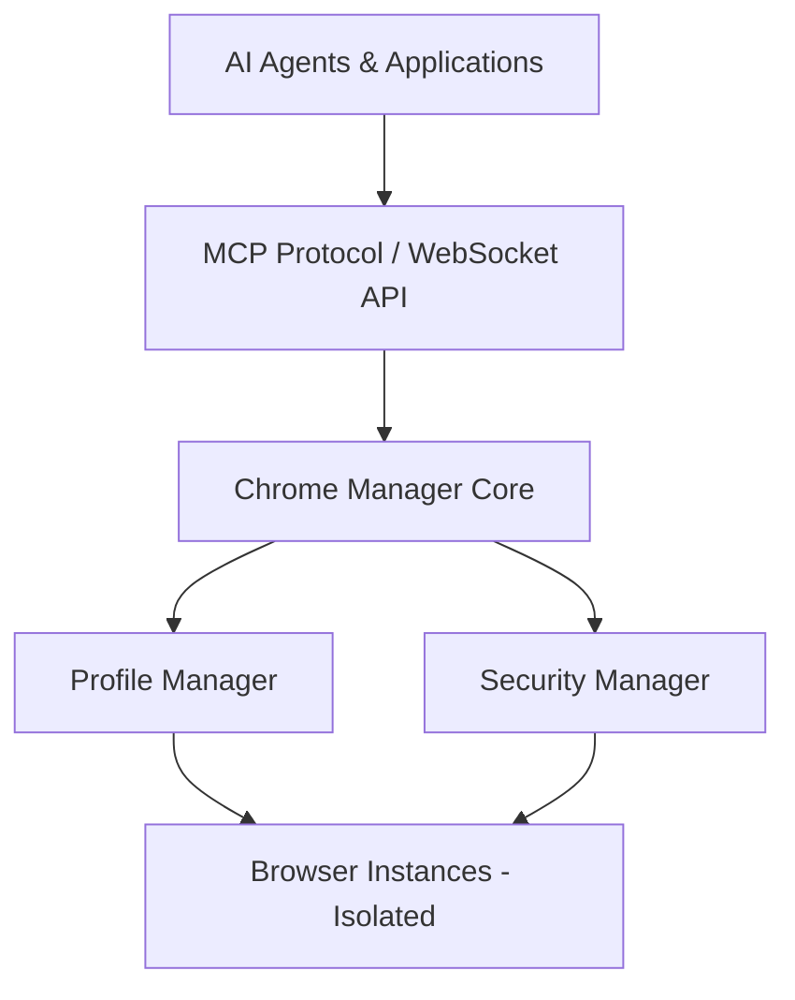

# 🛡️ AMI-WEB: Enterprise Browser Automation Platform

**Secure, Compliant, and Undetectable Browser Automation for Enterprise Applications**

AMI-WEB is an enterprise-grade browser automation platform that prioritizes security, privacy, and observability while maintaining undetectable operation. Built for organizations requiring compliant web automation, security testing, and AI-powered browser interactions.

## 🎯 Key Benefits

### For Enterprise
- **🔐 Security-First Architecture**: Four-tier security model with configurable TLS, certificate validation, and safe browsing
- **📊 Complete Observability**: Full audit trails, performance metrics, and compliance reporting
- **🏢 Multi-Tenant Isolation**: Secure profile and session isolation for different users/clients
- **✅ Compliance Ready**: Built-in audit logging and security controls for regulatory requirements

### For Developers
- **🤖 AI Integration**: Native MCP protocol support for Claude, Gemini, and custom AI agents
- **🚀 High Performance**: Async architecture with connection pooling and resource optimization
- **🛠️ 40+ Browser Tools**: Comprehensive API for complete browser control
- **🧪 Battle-Tested**: Extensive test suite with real-world validation

### For Security Teams
- **🔍 WIP Integrated Proxy and Traffic Analysis with Automated Hooks**: Built-in packet inspection and modification capabilities
- **👁️ Full/100% Browser Observability and Control**: Complete visibility into all browser operations and network activity
- **🛡️ Safe Downloads**: OS-integrated malware scanning via Chrome SafeBrowsing
- **🔒 Certificate Management**: Flexible TLS configuration for security testing
- **📝 Audit Compliance**: Complete activity logging for security reviews

## 🚀 Quick Start

### Installation

```bash
# Clone the repository
git clone https://github.com/Independent-AI-Labs/AMI-WEB.git
cd AMI-WEB

# Install uv for fast dependency management (recommended)
pip install uv

# Create virtual environment and install dependencies
uv venv .venv
.venv\Scripts\activate  # Windows
# or
source .venv/bin/activate  # macOS/Linux

uv pip install -r requirements.txt
uv pip install -r requirements-test.txt  # For development

# Copy and configure settings
cp config.sample.yaml config.yaml
```

### Basic Usage

```python
from backend.core.management.manager import ChromeManager

async def main():
    # Initialize the platform
    manager = ChromeManager()
    await manager.initialize()
    
    # Launch a secure browser instance
    browser = await manager.get_or_create_instance(
        profile="production",      # Isolated profile
        security_level="strict",   # Maximum security
        headless=True              # Server operation
    )
    
    # Perform automation
    browser.driver.get("https://example.com")
    # Your automation logic here
```

### AI Agent Integration

```json
// Claude Desktop configuration
{
  "mcpServers": {
    "ami-web": {
      "command": "python",
      "args": ["scripts/start_mcp_server.py"],  // Defaults to stdio mode
      "cwd": "/path/to/AMI-WEB"
    }
  }
}
```

## 🔐 Security Levels

| Level | Use Case | Certificate Validation | Safe Browsing | Site Isolation |
|-------|----------|----------------------|---------------|----------------|
| **STRICT** | Production | ✅ Enforced | ✅ Enhanced | ✅ Enabled |
| **STANDARD** | General Use | ✅ Enforced | ✅ Enabled | ✅ Enabled |
| **RELAXED** | Development | ⚠️ Flexible | ✅ Enabled | ✅ Enabled |
| **PERMISSIVE** | Testing | ❌ Optional | ❌ Optional | ❌ Optional |

## 📦 Core Features

### Browser Environment Management
- **Persistent Profiles**: Maintain separate browser environments
- **Session Management**: Save and restore complete browser states
- **Cookie Persistence**: Secure credential storage across sessions
- **Download Management**: Isolated, scanned download directories

### Anti-Detection Technology
- **Undetectable Operation**: Bypasses modern bot detection systems
- **Fingerprint Protection**: Dynamic WebGL, canvas, and audio spoofing
- **Human-like Behavior**: Natural interaction patterns
- **Stealth Mode**: Complete automation marker elimination

### Enterprise Integration
- **MCP Protocol**: Standard interface for AI agents
- **WebSocket API**: Real-time bidirectional communication
- **REST API**: Traditional integration options
- **Event Streaming**: Live monitoring and alerts

## 🏗️ Architecture



## 📈 Performance

- **Startup Time**: < 1 second with warm pool
- **Concurrent Sessions**: 40+ browsers per server
- **Memory Efficiency**: ~100MB per instance
- **Response Time**: < 10ms API overhead
- **CPU Usage**: Zero polling - event-driven architecture
- **Resource Management**: Automatic cleanup prevents memory leaks

## 🚧 Work in Progress

### Network Security Suite
**Traffic Analysis & Inspection via mitmproxy**
- Request/response filtering and modification
- SSL/TLS interception with certificate management
- Source/destination whitelisting
- API mocking and replay
- Automated hook system for traffic manipulation

### Advanced Automation
**Action Recording & Replay**
- Selenium IDE compatible format
- Visual test generation
- Cross-browser playback
- CI/CD integration

### Enhanced Content Tools
**Intelligent Search & Processing**
- AI-powered content extraction
- Smart pagination and truncation
- Context-aware search with regex
- Performance testing suite

## 🤝 Support & Services

### Community
- [GitHub Issues](https://github.com/Independent-AI-Labs/AMI-WEB/issues) - Bug reports and features
- [Discussions](https://github.com/Independent-AI-Labs/AMI-WEB/discussions) - Questions and ideas
- [Documentation](README_EXTENDED.md) - Detailed technical documentation

### Enterprise
- **Professional Support**: SLA-backed assistance
- **Custom Development**: Tailored features for your needs
- **Security Consulting**: Compliance and audit support
- **Training**: Team onboarding and best practices

## 📄 License

MIT License - see [LICENSE](LICENSE) for details

## 🙏 Acknowledgments

Built with industry-leading technologies:
- [Selenium WebDriver](https://www.selenium.dev/) - Browser automation
- [Chrome DevTools Protocol](https://chromedevtools.github.io/devtools-protocol/) - Deep browser control
- [Model Context Protocol](https://github.com/anthropics/mcp) - AI integration standard

---

**🛡️ Enterprise-Grade Browser Automation**

Built for security. Designed for agentic AI at scale.

[Get Started](https://github.com/Independent-AI-Labs/AMI-WEB) | [Documentation](README_EXTENDED.md)