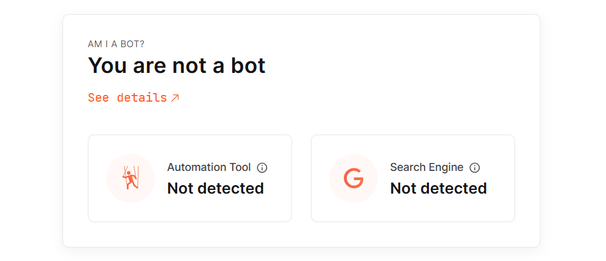

# 🤖 AMI-WEB Safe & Compliant Browser Automation

An advanced Chrome automation framework with **undetectable browser fingerprinting**, **Model Context Protocol (MCP) server**, and enterprise-grade pooling. Built for AI agents, web scraping, testing, and automation at scale.



## ✨ Why AMI-WEB?

Traditional browser automation tools are easily detected by modern websites. AMI-WEB solves this with:

- **🥷 Stealth Mode**: Advanced anti-detection that bypasses bot detection on sites like bot.sannysoft.com
- **🤖 AI-Ready**: Native MCP servers (stdio & WebSocket) for seamless integration with Claude, Gemini, and other AI agents
- **⚡ Lightning Fast**: Async architecture with intelligent browser pooling for massive scale
- **🔒 Battle-Tested**: Comprehensive test suite with real-world anti-bot verification

## 🎯 Key Features

### Undetectable Browser Automation
- **WebDriver Detection Bypass**: Removes all traces of automation
- **Plugin Spoofing**: Mimics real Chrome plugins (PDF, Chrome Viewer, Native Client)
- **WebGL Fingerprinting**: Realistic GPU vendor/renderer spoofing
- **H264 Codec Support**: Returns authentic codec responses
- **Window.open() Injection**: Maintains stealth across all tabs and popups
- **CDP Script Injection**: Pre-page-load script execution for perfect timing

### MCP Server Integration
- **Stdio Server**: Direct integration with Claude Desktop, Gemini CLI, and other MCP clients
- **WebSocket API**: Real-time bidirectional communication for custom integrations
- **30+ Browser Tools**: Complete browser control via standardized protocol
- **Token-Limited HTML**: Smart HTML extraction with automatic depth adjustment (25k token limit)
- **Event Streaming**: Live console logs, network activity, and performance metrics
- **Session Management**: Persistent browser sessions with state preservation

### Enterprise Architecture
- **Connection Pooling**: Pre-warmed browser instances for instant availability
- **Resource Management**: Automatic cleanup and memory optimization
- **Thread-Safe Operations**: Concurrent automation without race conditions
- **Graceful Degradation**: Fallback strategies for resilient operation
- **Structured Logging**: Comprehensive debugging with Loguru

## 🚀 Quick Start

```bash
# Clone and install
git clone https://github.com/Independent-AI-Labs/AMI-WEB.git
cd AMI-WEB
pip install -r requirements.txt

# Run the stdio MCP server (for Claude, Gemini CLI, etc.)
python mcp_stdio_server.py

# Or run the WebSocket server for custom integrations
python -m chrome_manager.mcp.server

# Or use directly in Python
from chrome_manager.core.manager import ChromeManager

async def main():
    manager = ChromeManager()
    await manager.initialize()
    
    # Get an undetectable browser instance
    browser = await manager.get_or_create_instance(
        headless=False,
        anti_detect=True  # Enable stealth mode
    )
    
    # Navigate and interact
    browser.driver.get("https://bot.sannysoft.com")
    # All bot detection tests will pass!
```

## 🎮 MCP Server Usage

### Method 1: Stdio Server (Claude Desktop, Gemini CLI)

The stdio server integrates directly with MCP-compatible tools:

#### Claude Desktop Configuration

Add to your Claude Desktop configuration (`claude_desktop_config.json`):

```json
{
  "mcpServers": {
    "chrome-automation": {
      "command": "python",
      "args": ["mcp_stdio_server.py"],
      "cwd": "/path/to/AMI-WEB"
    }
  }
}
```

#### Gemini CLI Configuration

For Gemini CLI or other MCP stdio clients:

```bash
# Start the stdio server
python mcp_stdio_server.py

# The server communicates via stdin/stdout using JSON-RPC
# All 40+ browser tools are available through the MCP protocol
```

### Method 2: WebSocket Server (Custom Integrations)

Connect any WebSocket client to control browsers:

```javascript
// JavaScript/Node.js example
const ws = new WebSocket('ws://localhost:8765');

ws.on('open', () => {
    // Launch browser
    ws.send(JSON.stringify({
        type: 'tool',
        tool: 'browser_launch',
        parameters: { headless: false },
        request_id: '123'
    }));
});

ws.on('message', (data) => {
    const response = JSON.parse(data);
    if (response.result?.instance_id) {
        // Navigate to page
        ws.send(JSON.stringify({
            type: 'tool',
            tool: 'browser_navigate',
            parameters: {
                instance_id: response.result.instance_id,
                url: 'https://example.com'
            },
            request_id: '124'
        }));
    }
});
```

## 🛠️ Available MCP Tools

<details>
<summary><b>Browser Lifecycle (4 tools)</b></summary>

- `browser_launch` - Start a new browser instance
- `browser_close` - Close and cleanup instance
- `browser_list` - List all active instances
- `browser_get_tabs` - Get all open tabs
</details>

<details>
<summary><b>Navigation & Interaction (8 tools)</b></summary>

- `browser_navigate` - Go to URL with smart waiting
- `browser_click` - Click elements with retry logic
- `browser_type` - Type text with human-like timing
- `browser_scroll` - Smooth or instant scrolling
- `browser_wait_for_element` - Wait for element presence
- `browser_back` / `browser_forward` / `browser_refresh`
</details>

<details>
<summary><b>Content Extraction (6 tools)</b></summary>

- `browser_get_html` - Get HTML with token limiting
- `browser_extract_text` - Extract readable text
- `browser_extract_links` - Get all page links
- `browser_screenshot` - Capture page/element/viewport
- `browser_execute_script` - Run JavaScript code
- `browser_get_cookies` - Extract browser cookies
</details>

<details>
<summary><b>Storage & Data (8 tools)</b></summary>

- `browser_get_local_storage` - Read localStorage
- `browser_set_local_storage` - Write to localStorage
- `browser_remove_local_storage` - Delete items
- `browser_clear_local_storage` - Clear all storage
- `browser_get_session_storage` - Read sessionStorage
- `browser_set_session_storage` - Write sessionStorage
- `browser_set_cookies` - Set browser cookies
</details>

<details>
<summary><b>Monitoring & Debugging (4 tools)</b></summary>

- `browser_get_console_logs` - Capture console output
- `browser_get_network_logs` - Monitor network activity
- `browser_switch_tab` - Change active tab
- `browser_get_performance_metrics` - Page performance data
</details>

## 🏗️ Architecture

AMI-WEB uses a layered architecture for maintainability and extensibility:

```
┌─────────────────────────────────────────────┐
│            MCP WebSocket Server             │  <- AI Agents, Clients
├─────────────────────────────────────────────┤
│             Chrome Manager                  │  <- Orchestration Layer
├─────────────────────────────────────────────┤
│    Instance Pool  │  Session Manager        │  <- Resource Management
├─────────────────────────────────────────────┤
│         Browser Instance + Anti-Detect      │  <- Core Automation
├─────────────────────────────────────────────┤
│  Navigation │ Input │ Screenshot │ DevTools │  <- Facade Controllers
├─────────────────────────────────────────────┤
│           Selenium WebDriver + CDP          │  <- Browser Control
└─────────────────────────────────────────────┘
```

### MCP Server Modes

AMI-WEB provides two MCP server implementations:

1. **Stdio Server** (`mcp_stdio_server.py`): For direct integration with MCP clients
   - Used by: Claude Desktop, Gemini CLI, MCP-compatible tools
   - Protocol: JSON-RPC over stdin/stdout
   - Best for: AI assistants and chatbots

2. **WebSocket Server** (`server.py`): For custom integrations
   - Used by: Web apps, custom clients, distributed systems
   - Protocol: JSON-RPC over WebSocket
   - Best for: Real-time applications and multi-client scenarios

See [ARCHITECTURE.md](ARCHITECTURE.md) for detailed technical documentation.

## 🧪 Testing

```bash
# Run all tests
pytest

# Run anti-detection tests
pytest tests/integration/test_antidetection.py -v

# Run with coverage
pytest --cov=chrome_manager --cov-report=html

# Test MCP WebSocket server
pytest tests/integration/test_mcp_server.py -v

# Test stdio server
python mcp_stdio_server.py --test
```

## 📊 Performance

- **Startup Time**: < 1s with warm pool
- **Page Navigation**: 0.5-2s average
- **Screenshot Capture**: 50-200ms
- **Script Execution**: < 10ms overhead
- **Memory per Instance**: ~100-150MB
- **Concurrent Instances**: 10-50+ depending on resources

## 🔒 Security Features

- No credential storage in code
- Isolated browser profiles
- Automatic cookie cleanup
- Sandboxed JavaScript execution
- Request/response filtering
- Domain-based access control

## 🎨 Use Cases

### Web Scraping at Scale
Extract data from JavaScript-heavy sites without detection. Handle dynamic content, infinite scrolling, and AJAX requests seamlessly.

### Automated Testing
Replace flaky Selenium tests with reliable, undetectable automation. Perfect for E2E testing of anti-bot protected applications.

### AI Web Agents
Enable LLMs to browse the web naturally. The MCP protocol provides structured tool access for autonomous web navigation. Works seamlessly with:
- **Claude Desktop**: Native MCP integration for web browsing capabilities
- **Gemini CLI**: Add browser automation to Google's AI
- **Custom Agents**: Build your own AI agents with WebSocket or stdio integration

### Price Monitoring
Track prices across e-commerce sites that block bots. Maintain persistent sessions for authenticated monitoring.

### Social Media Automation
Manage multiple accounts safely with unique browser fingerprints. Avoid platform detection algorithms.

## 🤝 Contributing

We welcome contributions! Please see [CONTRIBUTING.md](CONTRIBUTING.md) for guidelines.

## 📄 License

MIT License - see [LICENSE](LICENCE) for details.

## 🙏 Acknowledgments

Built with:
- [Selenium WebDriver](https://www.selenium.dev/) - Browser automation
- [Model Context Protocol](https://github.com/anthropics/mcp) - AI integration standard
- [Loguru](https://github.com/Delgan/loguru) - Beautiful logging
- [Pydantic](https://pydantic-docs.helpmanual.io/) - Data validation

---

**⭐ Star us on GitHub if this helps you bypass bot detection!**

**🤖 Using with Claude or Gemini? Check out our [MCP Integration Guide](MCP.md)**

**🐛 Found a detection issue? Open an issue with the site URL!**
