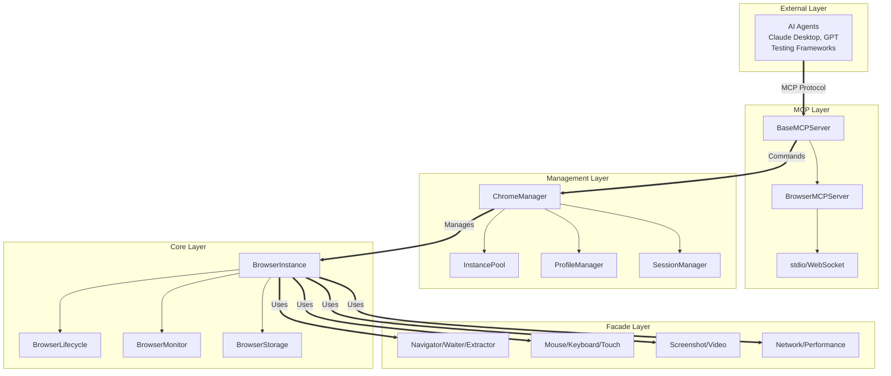
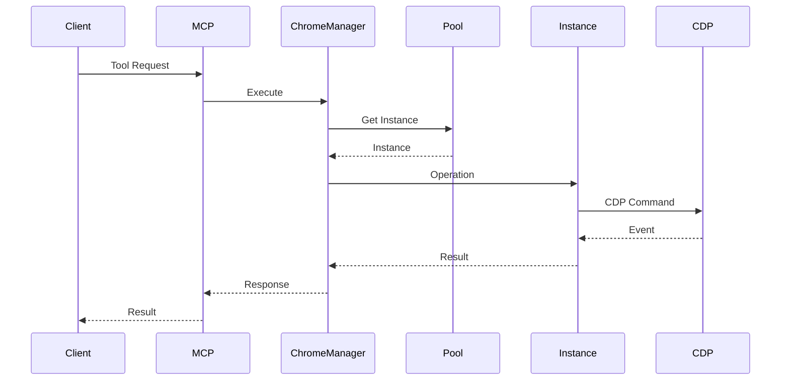

# 🏗️ AMI-WEB Architecture Documentation

## Table of Contents
1. [System Overview](#system-overview)
2. [Module Organization](#module-organization)
3. [Core Components](#core-components)
4. [Anti-Detection System](#anti-detection-system)
5. [MCP Server Implementation](#mcp-server-implementation)
6. [Design Patterns](#design-patterns)
7. [Data Flow](#data-flow)
8. [Testing Architecture](#testing-architecture)

## System Overview

AMI-WEB is an enterprise browser automation platform built with a layered architecture focused on:
- **Complete Browser Control**: Full manipulation of all browser parameters and fingerprints
- **Event-Driven Architecture**: CDP-based event system with zero polling
- **Multi-Profile Isolation**: Persistent browser profiles with complete state management
- **AI Integration**: Native Model Context Protocol (MCP) for LLM control

### High-Level Architecture



## Module Organization

```
backend/
├── core/                          # Core browser functionality
│   ├── browser/                  # Browser instance management
│   │   ├── instance.py           # Main BrowserInstance class (composition pattern)
│   │   ├── lifecycle.py          # Browser launch/terminate operations
│   │   ├── options.py            # Chrome options builder
│   │   ├── properties_manager.py # Browser properties injection
│   │   └── tab_manager.py        # Tab lifecycle management
│   ├── management/               # Resource management
│   │   ├── manager.py           # ChromeManager orchestrator
│   │   ├── pool.py              # Instance pool with health checks
│   │   ├── profile_manager.py   # Profile persistence
│   │   └── session_manager.py   # Session save/restore
│   ├── monitoring/              # Real-time monitoring
│   │   └── monitor.py           # Console, network, performance tracking
│   ├── security/                # Anti-detection
│   │   ├── antidetect.py        # ChromeDriver patching
│   │   └── tab_injector.py      # CDP script injection
│   └── storage/                 # Data persistence
│       └── storage.py           # Cookies, localStorage, downloads
├── facade/                      # High-level interfaces
│   ├── input/                  # Input simulation
│   │   ├── keyboard.py         # Keyboard with human timing
│   │   ├── mouse.py            # Mouse with trajectories
│   │   ├── touch.py            # Touch gestures
│   │   └── forms.py            # Form interactions
│   ├── navigation/             # Page navigation
│   │   ├── navigator.py        # Page navigation
│   │   ├── waiter.py           # Element waiting
│   │   ├── extractor.py        # Content extraction
│   │   ├── scroller.py         # Scroll control
│   │   └── storage.py          # localStorage/sessionStorage
│   ├── media/                  # Media capture
│   │   ├── screenshot.py       # Screenshots
│   │   └── video.py            # Video recording
│   ├── devtools/               # DevTools integration
│   │   ├── network.py          # Network monitoring
│   │   ├── performance.py      # Performance metrics
│   │   └── devtools.py         # Console logs
│   └── context/                # Context management
│       ├── tabs.py             # Tab management
│       └── frames.py           # Frame handling
├── mcp/                        # Model Context Protocol
│   ├── base/                   # Generic MCP components
│   │   ├── mcp_server.py       # Base server class
│   │   ├── protocol.py         # JSON-RPC handler
│   │   ├── transport.py        # stdio/WebSocket transports
│   │   ├── auth.py             # Authentication middleware
│   │   └── rate_limit.py       # Rate limiting
│   └── browser/                # Browser MCP implementation
│       ├── server.py           # BrowserMCPServer
│       ├── run_stdio.py        # stdio entry point
│       ├── run_websocket.py    # WebSocket entry point
│       └── tools/              # Tool definitions
│           ├── definitions.py  # Tool specifications
│           ├── executor.py     # Tool execution
│           └── registry.py     # Tool registry
├── models/                     # Data models
│   ├── browser.py             # Browser-related models
│   ├── browser_properties.py  # Fingerprint models
│   ├── security.py            # Security configurations
│   ├── media.py               # Media models
│   └── mcp.py                 # MCP protocol models
├── utils/                      # Utilities
│   ├── config.py              # Configuration management
│   ├── exceptions.py          # Custom exceptions
│   ├── javascript.py          # JS utilities
│   ├── parser.py              # HTML/DOM parsing
│   ├── paths.py               # Path management
│   ├── selectors.py           # CSS selector validation
│   ├── threading.py           # Async utilities
│   └── timing.py              # Time utilities
├── scripts/                    # JavaScript injection scripts
│   └── complete-antidetect.js # Anti-detection script
├── services/                   # Service layer
│   └── property_injection.py  # Property injection service
└── templates/                  # JS templates
    └── browser_properties.js   # Property templates
```

## Core Components

### ChromeManager (`backend/core/management/manager.py`)
Central orchestrator managing browser lifecycle and resources:
- Instance pool management with warm instances
- Profile and session coordination
- Configuration management
- Resource cleanup and health monitoring

### BrowserInstance (`backend/core/browser/instance.py`)
Individual browser instance using composition pattern:
- Delegates lifecycle to `BrowserLifecycle`
- Uses `BrowserMonitor` for tracking
- Manages storage through `BrowserStorage`
- Builds options via `BrowserOptionsBuilder`

### InstancePool (`backend/core/management/pool.py`)
Efficient browser instance pooling:
- Pre-warmed instances for instant availability
- Health checks on idle instances only
- TTL management for resource optimization
- Automatic cleanup of terminated instances

### ProfileManager (`backend/core/management/profile_manager.py`)
Chrome profile management using native user-data-dir:
- Creates isolated profile directories
- Manages profile metadata
- Handles cookie persistence
- Supports profile copying and deletion

## Anti-Detection System

### CDP Script Injection (`backend/core/security/tab_injector.py`)
**EVENT-DRIVEN - NO POLLING!** Uses Chrome DevTools Protocol for automatic injection:

```python
# One-time setup that handles all future documents
driver.execute_cdp_cmd("Page.addScriptToEvaluateOnNewDocument", {
    "source": antidetect_script,
    "worldName": "",  # Main world
    "runImmediately": True
})
```

### Anti-Detection Script (`backend/scripts/complete-antidetect.js`)
Comprehensive fingerprint spoofing:
- WebDriver property removal
- Plugin array simulation
- WebGL vendor/renderer spoofing
- Canvas noise injection
- Audio context modification
- Chrome runtime simulation
- Permissions API override

### ChromeDriver Patching (`backend/core/security/antidetect.py`)
Binary-level modifications:
- Removes `cdc_` variables
- Patches automation indicators
- Modifies WebDriver detection points

## MCP Server Implementation

### Base Architecture (`backend/mcp/base/`)
Generic MCP server components:
- `BaseMCPServer`: Abstract base with protocol handling
- `JSONRPCHandler`: JSON-RPC 2.0 protocol implementation
- `WebSocketTransport` & `StdioTransport`: Communication layers
- Middleware support for auth and rate limiting

### Browser Implementation (`backend/mcp/browser/`)
Browser-specific MCP server:
- `BrowserMCPServer`: Inherits from `BaseMCPServer`
- Tool registry with all browser operations
- `ToolExecutor`: Executes tools via ChromeManager
- Entry points: `run_stdio.py` and `run_websocket.py`

### Tool Categories
- **Browser Lifecycle**: launch, terminate, list instances
- **Navigation**: navigate, back, forward, refresh
- **Input**: click, type, select, scroll, execute_script
- **Content**: extract text, HTML, forms, links
- **Media**: screenshots (viewport, full-page, element)
- **Storage**: cookies, localStorage, sessionStorage
- **Monitoring**: console logs, network logs, performance
- **Profiles**: create, list, delete profiles
- **Sessions**: save, load, list sessions

## Design Patterns

### Composition Pattern
`BrowserInstance` composes specialized components instead of inheritance:
```python
class BrowserInstance:
    def __init__(self):
        self._lifecycle = BrowserLifecycle()
        self._monitor = BrowserMonitor()
        self._storage = BrowserStorage()
        self._options_builder = BrowserOptionsBuilder()
```

### Facade Pattern
Simplified interfaces hiding complex operations:
```python
# Complex CDP and WebDriver operations
# Simplified to:
await navigator.navigate(url)
await mouse.click(selector)
await extractor.get_html()
```

### Registry Pattern
Tool registration and discovery:
```python
registry = ToolRegistry()
register_all_tools(registry)
executor = ToolExecutor(manager)
```

## Data Flow

### Request Lifecycle
1. Client sends MCP request (stdio or WebSocket)
2. `BaseMCPServer` receives and validates
3. `BrowserMCPServer.execute_tool()` processes
4. `ToolExecutor` delegates to ChromeManager
5. ChromeManager gets/creates instance from pool
6. BrowserInstance executes via facade layer
7. Response flows back through MCP protocol

### Event Flow


## Testing Architecture

### Test Structure
```
tests/
├── unit/                    # Component tests
│   ├── test_chrome_manager.py
│   ├── test_mcp_auth.py
│   └── test_mcp_rate_limit.py
├── integration/            # Cross-component tests
│   ├── test_browser_integration.py
│   ├── test_browser_properties.py
│   ├── test_profiles_sessions.py
│   ├── test_screen_space_interactions.py
│   ├── test_mcp_server.py
│   ├── test_mcp_environment_tools.py
│   └── test_antidetection.py
├── fixtures/              # Test data
│   └── html/             # Test HTML pages
└── conftest.py           # Shared fixtures
```

### Test Infrastructure
- Session-scoped ChromeManager for efficiency
- Function-scoped browser instances for isolation
- Local HTTP server for test pages
- Automatic cleanup with context managers

### Running Tests
```bash
# Using test runner with environment setup
python scripts/run_tests.py

# Run specific test
python scripts/run_tests.py tests/integration/test_antidetection.py -v

# Run with coverage
python scripts/run_tests.py --cov=backend --cov-report=html
```

## Key Architectural Decisions

### Event-Driven, No Polling
All tab monitoring uses CDP events instead of polling loops, eliminating CPU overhead.

### Composition Over Inheritance
BrowserInstance uses composition to combine lifecycle, monitoring, and storage components.

### Profile Isolation
Each profile gets a separate Chrome user-data-dir for complete isolation.

### MCP Separation
Generic MCP logic in `base/`, browser-specific in `browser/` for reusability.

### Unified Entry Point
Single `scripts/start_mcp_server.py` handles both stdio and WebSocket modes.

---

*This architecture enables complete browser control with undetectable automation for enterprise applications.*