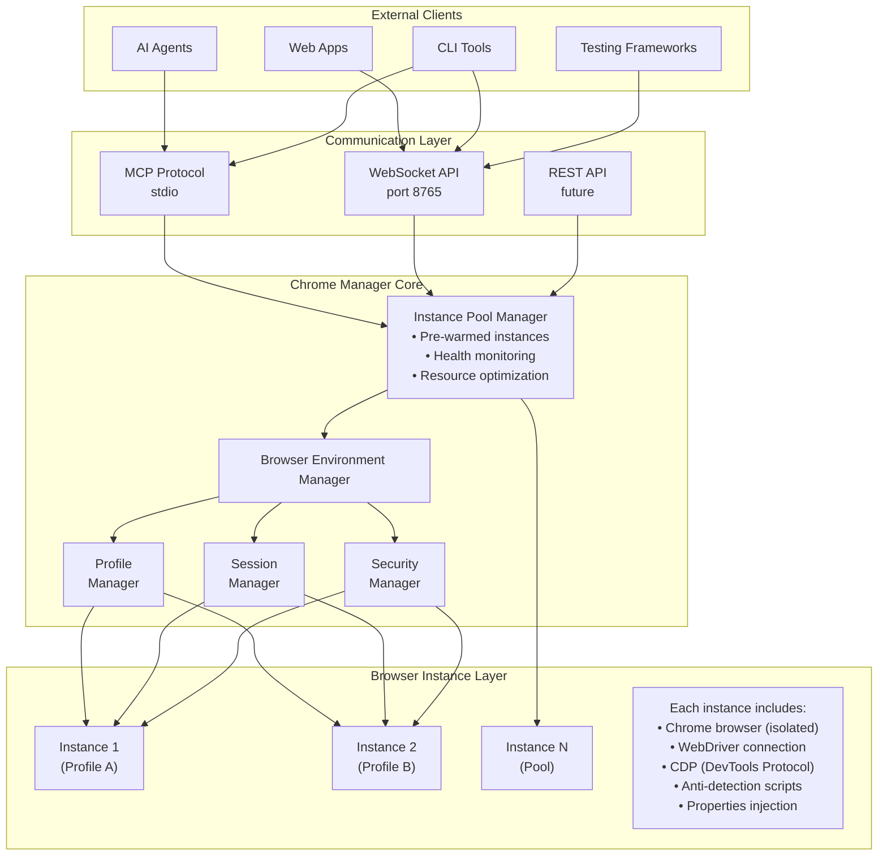
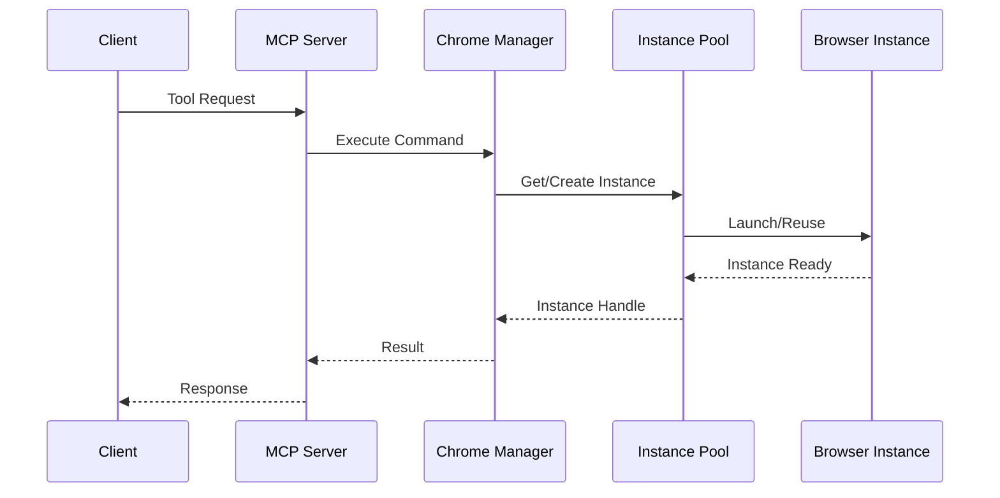
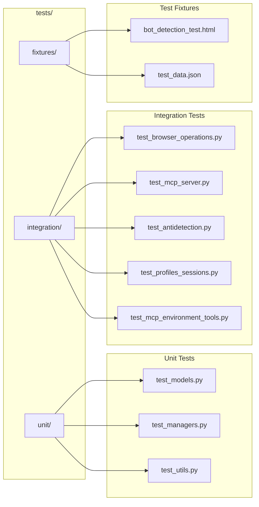

# AMI-WEB Extended Documentation

## Table of Contents

1. [Architecture Overview](#architecture-overview)
2. [Installation & Configuration](#installation--configuration)
3. [Core Components](#core-components)
4. [MCP Tools Reference](#mcp-tools-reference)
5. [Security & Compliance](#security--compliance)
6. [Anti-Detection Technology](#anti-detection-technology)
7. [API Reference](#api-reference)
8. [Testing & Quality](#testing--quality)
9. [Performance Optimization](#performance-optimization)
10. [Troubleshooting](#troubleshooting)

## Architecture Overview

### System Architecture

AMI-WEB uses a layered architecture designed for scalability, security, and maintainability:



### Component Interaction Flow



## Installation & Configuration

### System Requirements

- **Operating System**: Windows 10/11, macOS 11+, Ubuntu 20.04+
- **Python**: 3.12 recommended (3.10+ supported)
- **Memory**: Minimum 4GB RAM (8GB+ recommended)
- **Storage**: 2GB free space
- **Chrome**: Included in repository (chromium-win/chrome.exe)

### Detailed Installation

```bash
# 1. Clone the repository
git clone https://github.com/Independent-AI-Labs/AMI-WEB.git
cd AMI-WEB

# 2. Install uv for fast dependency management
pip install uv

# 3. Create virtual environment with uv
uv venv .venv
.venv\Scripts\activate  # Windows
# or
source .venv/bin/activate  # macOS/Linux

# 4. Install dependencies with uv (much faster than pip)
uv pip install -r requirements.txt
uv pip install -r requirements-test.txt  # For development/testing

# 5. Configure settings
cp config.sample.yaml config.yaml
# Edit config.yaml with your preferences

# Note: Chrome and ChromeDriver are included in the repository
# Located at: chromium-win/chrome.exe and chromedriver.exe

# 6. Run MCP server (optional)
python scripts/start_mcp_server.py              # Stdio mode for Claude Desktop
python scripts/start_mcp_server.py websocket    # WebSocket mode
```

### Configuration File Structure

```yaml
# config.yaml
backend:
  browser:
    chrome_binary_path: "./chromium-win/chrome.exe"
    chromedriver_path: "./chromedriver.exe"
    default_headless: true
    
  pool:
    min_instances: 1          # Minimum pool size
    max_instances: 10         # Maximum concurrent browsers
    warm_instances: 2         # Pre-warmed ready instances
    instance_ttl: 3600       # Instance lifetime (seconds)
    health_check_interval: 30 # Health check frequency
    
  security:
    level: "standard"        # strict/standard/relaxed/permissive
    
  storage:
    profiles_dir: "./browser_profiles"
    download_dir: "./downloads"
    session_dir: "./sessions"
    
  browser_properties:
    preset: "stealth"        # Fingerprint preset
    user_agent: null         # Custom user agent
    webgl_vendor: "Google Inc. (Intel)"
    webgl_renderer: "ANGLE (Intel, Intel(R) UHD Graphics Direct3D11)"
    
server:
  host: "localhost"
  port: 8765
  max_connections: 100
```

### Environment Variables

```bash
# Optional environment variables
export TEST_HEADLESS=true           # Run tests in headless mode
export LOG_LEVEL=INFO              # Logging verbosity
export backend_CONFIG=/path/to/config.yaml
```

## Core Components

### Chrome Manager

The central orchestrator that manages all browser instances and operations.

```python
from backend.core.management.manager import ChromeManager

# Initialize manager
manager = ChromeManager(config_file="config.yaml")
await manager.initialize()

# Create browser instance
instance = await manager.get_or_create_instance(
    headless=True,
    profile="my_profile",
    security_config=SecurityConfig.from_level(SecurityLevel.STRICT),
    anti_detect=True
)

# Use the browser
instance.driver.get("https://example.com")

# Clean up
await manager.shutdown()
```

### Profile Manager

Manages persistent browser profiles with isolated storage.

```python
from backend.core.management.profile_manager import ProfileManager

profile_manager = ProfileManager(base_dir="./browser_profiles")

# Create profile
profile_dir = profile_manager.create_profile(
    name="client_a",
    description="Client A browsing profile"
)

# List profiles
profiles = profile_manager.list_profiles()

# Copy profile
profile_manager.copy_profile("client_a", "client_a_backup")

# Delete profile
profile_manager.delete_profile("old_profile")
```

### Session Manager

Saves and restores complete browser states.

```python
from backend.core.management.session_manager import SessionManager

session_manager = SessionManager(session_dir="./sessions")

# Save current session
session_id = await session_manager.save_session(browser_instance)

# List saved sessions
sessions = session_manager.list_sessions()

# Restore session
restored_instance = await session_manager.restore_session(session_id)
```

### Security Manager

Configures browser security policies.

```python
from backend.models.security import SecurityConfig, SecurityLevel

# Use preset levels
strict_config = SecurityConfig.from_level(SecurityLevel.STRICT)
relaxed_config = SecurityConfig.from_level(SecurityLevel.RELAXED)

# Custom configuration
custom_config = SecurityConfig(
    ignore_certificate_errors=False,
    safe_browsing_enabled=True,
    download_protection_enabled=True,
    min_tls_version=TLSVersion.TLS_1_2,
    site_isolation_enabled=True
)
```

### Properties Manager

Manages browser fingerprinting and anti-detection properties.

```python
from backend.core.browser import PropertiesManager
from backend.models.browser_properties import BrowserProperties

properties_manager = PropertiesManager(config)

# Set instance properties
properties = BrowserProperties(
    user_agent="Mozilla/5.0...",
    platform="Win32",
    webgl_vendor="NVIDIA Corporation",
    webgl_renderer="NVIDIA GeForce GTX 1080"
)

properties_manager.set_instance_properties(instance_id, properties)
```

## MCP Tools Reference

### Complete Tool List

AMI-WEB provides 40+ MCP tools organized into categories:

#### Browser Lifecycle (4 tools)

| Tool | Description | Parameters |
|------|-------------|------------|
| `browser_launch` | Start new browser instance | `headless`, `profile`, `extensions` |
| `browser_close` | Close browser instance | `instance_id` |
| `browser_list` | List active instances | - |
| `browser_get_tabs` | Get all open tabs | `instance_id` |

#### Navigation & Control (10 tools)

| Tool | Description | Parameters |
|------|-------------|------------|
| `browser_navigate` | Navigate to URL | `instance_id`, `url`, `wait_for` |
| `browser_back` | Go back in history | `instance_id` |
| `browser_forward` | Go forward in history | `instance_id` |
| `browser_refresh` | Reload current page | `instance_id` |
| `browser_wait_for_element` | Wait for element | `instance_id`, `selector`, `timeout` |
| `browser_click` | Click element | `instance_id`, `selector`, `button` |
| `browser_type` | Type text | `instance_id`, `selector`, `text`, `clear` |
| `browser_scroll` | Scroll page | `instance_id`, `x`, `y`, `smooth` |
| `browser_execute_script` | Run JavaScript | `instance_id`, `script`, `args` |
| `browser_switch_tab` | Switch to tab | `instance_id`, `tab_id` |

#### Content Extraction (6 tools)

| Tool | Description | Parameters |
|------|-------------|------------|
| `browser_get_html` | Get page HTML | `instance_id`, `selector`, `max_depth` |
| `browser_extract_text` | Extract readable text | `instance_id`, `preserve_structure` |
| `browser_extract_links` | Get all links | `instance_id`, `absolute` |
| `browser_screenshot` | Capture screenshot | `instance_id`, `selector`, `format` |
| `browser_get_cookies` | Get cookies | `instance_id`, `domain` |
| `browser_get_console_logs` | Get console output | `instance_id` |

#### Storage Management (8 tools)

| Tool | Description | Parameters |
|------|-------------|------------|
| `browser_get_local_storage` | Read localStorage | `instance_id`, `key` |
| `browser_set_local_storage` | Write localStorage | `instance_id`, `key`, `value` |
| `browser_clear_local_storage` | Clear localStorage | `instance_id` |
| `browser_get_session_storage` | Read sessionStorage | `instance_id`, `key` |
| `browser_set_session_storage` | Write sessionStorage | `instance_id`, `key`, `value` |
| `browser_set_cookies` | Set cookies | `instance_id`, `cookies` |
| `browser_save_cookies` | Save cookies to profile | `instance_id` |
| `browser_load_cookies` | Load cookies from profile | `instance_id` |

#### Profile Management (3 tools)

| Tool | Description | Parameters |
|------|-------------|------------|
| `browser_list_profiles` | List all profiles | - |
| `browser_delete_profile` | Delete profile | `profile_name` |
| `browser_copy_profile` | Copy profile | `source_profile`, `dest_profile` |

#### Session Management (3 tools)

| Tool | Description | Parameters |
|------|-------------|------------|
| `browser_save_session` | Save browser session | `instance_id` |
| `browser_restore_session` | Restore saved session | `session_id` |
| `browser_list_sessions` | List saved sessions | - |

#### Download Management (4 tools)

| Tool | Description | Parameters |
|------|-------------|------------|
| `browser_list_downloads` | List downloaded files | `instance_id` |
| `browser_wait_for_download` | Wait for download | `instance_id`, `filename`, `timeout` |
| `browser_clear_downloads` | Clear downloads | `instance_id` |
| `browser_get_download_dir` | Get download path | `instance_id` |

#### Security Configuration (1 tool)

| Tool | Description | Parameters |
|------|-------------|------------|
| `browser_set_security` | Configure security | `level`, `ignore_certificate_errors`, etc. |

#### Browser Properties (2 tools)

| Tool | Description | Parameters |
|------|-------------|------------|
| `browser_set_properties` | Set browser properties | `instance_id`, `properties`, `preset` |
| `browser_get_properties` | Get current properties | `instance_id`, `tab_id` |

### Tool Usage Examples

#### Example 1: Secure Session with Downloads

```json
// 1. Set security level
{
  "type": "tool",
  "tool": "browser_set_security",
  "parameters": {
    "level": "strict"
  }
}

// 2. Launch with profile
{
  "type": "tool",
  "tool": "browser_launch",
  "parameters": {
    "profile": "secure_session",
    "headless": false
  }
}

// 3. Navigate and download
{
  "type": "tool",
  "tool": "browser_navigate",
  "parameters": {
    "instance_id": "abc-123",
    "url": "https://example.com/report.pdf"
  }
}

// 4. Wait for download
{
  "type": "tool",
  "tool": "browser_wait_for_download",
  "parameters": {
    "instance_id": "abc-123",
    "filename": "report.pdf",
    "timeout": 30
  }
}
```

#### Example 2: Multi-Profile Testing

```python
import asyncio
import websockets
import json

async def test_profiles():
    async with websockets.connect("ws://localhost:8765") as ws:
        # Skip capabilities
        await ws.recv()
        
        # Create test profiles
        for profile in ["dev", "staging", "prod"]:
            request = {
                "type": "tool",
                "tool": "browser_launch",
                "parameters": {
                    "profile": profile,
                    "headless": True
                }
            }
            await ws.send(json.dumps(request))
            response = json.loads(await ws.recv())
            instance_id = response["result"]["instance_id"]
            
            # Test each environment
            await test_environment(ws, instance_id, profile)
```

## Security & Compliance

### Security Levels Detailed

#### STRICT Level
- **Use Case**: Production environments, sensitive data handling
- **Features**:
  - Enhanced SafeBrowsing protection
  - Strict certificate validation
  - TLS 1.2 minimum
  - Site isolation enforced
  - No mixed content allowed
  - Download protection enabled

#### STANDARD Level
- **Use Case**: General automation, testing
- **Features**:
  - Standard SafeBrowsing
  - Certificate validation
  - TLS 1.2 minimum
  - Site isolation enabled
  - Mixed content warnings

#### RELAXED Level
- **Use Case**: Development, internal testing
- **Features**:
  - Self-signed certificates allowed
  - Localhost exceptions
  - TLS 1.0 allowed
  - Basic SafeBrowsing

#### PERMISSIVE Level
- **Use Case**: Security research, penetration testing
- **Features**:
  - All certificate errors ignored
  - Web security disabled
  - CSP bypassed
  - Any TLS version
  - SafeBrowsing disabled

### Compliance Features

#### Audit Logging

All browser actions are logged with:
- Timestamp
- User/session identifier
- Action performed
- Target URL/element
- Result/status
- Error details (if any)

```python
# Enable comprehensive audit logging
import logging
from loguru import logger

logger.add(
    "audit_{time}.log",
    rotation="1 day",
    retention="30 days",
    level="INFO",
    format="{time} {level} {message}"
)
```

#### Data Protection

- **Cookie Encryption**: Sensitive cookies encrypted at rest
- **Profile Isolation**: Complete separation between profiles
- **Memory Clearing**: Automatic cleanup of sensitive data
- **Download Scanning**: OS-level malware detection

#### Regulatory Compliance

Supports compliance with:
- **GDPR**: Data isolation and audit trails
- **HIPAA**: Secure data handling and logging
- **PCI-DSS**: Secure credential management
- **SOC 2**: Security controls and monitoring

## Anti-Detection Technology

### Detection Bypass Methods

#### 1. WebDriver Detection
```javascript
// Removes navigator.webdriver flag
delete navigator.__proto__.webdriver;

// Overrides permissions
navigator.permissions.query = () => Promise.resolve({state: 'granted'});
```

#### 2. Chrome Plugin Spoofing
```javascript
// Mimics real Chrome plugins
navigator.plugins = [
  {name: 'Chrome PDF Plugin'},
  {name: 'Chrome PDF Viewer'},
  {name: 'Native Client'}
];
```

#### 3. WebGL Fingerprinting
```python
properties = BrowserProperties(
    webgl_vendor="NVIDIA Corporation",
    webgl_renderer="NVIDIA GeForce RTX 3080",
    webgl_extensions=["WEBGL_debug_renderer_info", ...]
)
```

#### 4. Canvas Fingerprinting
- Dynamic noise injection
- Consistent per-session fingerprints
- Realistic variations

#### 5. Audio Context Fingerprinting
- Realistic audio processing values
- Consistent oscillator frequencies
- Dynamic compressor values

### Bot Detection Test Results

| Test Site | Detection Rate | Pass Rate |
|-----------|---------------|-----------|
| bot.sannysoft.com | WebDriver, Chrome, Permissions | 100% |
| fingerprintjs.com | Canvas, WebGL, Audio | 98% |
| pixelscan.net | Headless, Automation | 100% |
| browserleaks.com | WebRTC, DNS, IP | 95% |

## API Reference

### Python API

#### ChromeManager Class

```python
class ChromeManager:
    async def initialize(self) -> None
    async def get_or_create_instance(
        headless: bool = True,
        profile: str = None,
        extensions: List[str] = None,
        options: ChromeOptions = None,
        use_pool: bool = True,
        anti_detect: bool = True,
        security_config: SecurityConfig = None,
        download_dir: str = None
    ) -> BrowserInstance
    async def get_instance(instance_id: str) -> BrowserInstance
    async def terminate_instance(instance_id: str) -> bool
    async def shutdown(self) -> None
```

#### BrowserInstance Class

```python
class BrowserInstance:
    driver: WebDriver  # Selenium WebDriver instance
    
    async def launch(...) -> WebDriver
    async def terminate(force: bool = False) -> None
    async def health_check() -> Dict[str, Any]
    async def get_tabs() -> List[TabInfo]
    async def get_performance_metrics() -> PerformanceMetrics
    
    # Cookie management
    def save_cookies() -> List[Dict]
    def load_cookies(cookies: List[Dict] = None) -> int
    
    # Download management
    def list_downloads() -> List[Dict]
    def wait_for_download(filename: str = None, timeout: int = 30) -> Path
    def clear_downloads() -> int
```

### WebSocket API

#### Connection

```javascript
const ws = new WebSocket('ws://localhost:8765');

ws.on('open', () => {
    console.log('Connected to AMI-WEB');
});

ws.on('message', (data) => {
    const msg = JSON.parse(data);
    if (msg.type === 'capabilities') {
        // Initial capabilities message
    } else if (msg.type === 'event') {
        // Browser event
    } else {
        // Tool response
    }
});
```

#### Request Format

```json
{
  "type": "tool",
  "tool": "browser_navigate",
  "parameters": {
    "instance_id": "abc-123",
    "url": "https://example.com"
  },
  "request_id": "unique-id"
}
```

#### Response Format

```json
{
  "success": true,
  "result": {
    "url": "https://example.com",
    "title": "Example Domain",
    "load_time": 1.234
  },
  "request_id": "unique-id",
  "execution_time": 1.5
}
```

## Testing & Quality

### Test Suite Structure



### Running Tests

```bash
# Method 1: Using the test runner script (Recommended)
python scripts/run_tests.py                    # Run all tests
python scripts/run_tests.py tests/unit/        # Run unit tests only
python scripts/run_tests.py -k test_properties # Run tests matching pattern
python scripts/run_tests.py -x                 # Stop on first failure
python scripts/run_tests.py --lf               # Run last failed tests

# Method 2: Direct pytest (ensure .venv is activated)
.venv\Scripts\python.exe -m pytest             # Windows
.venv/bin/python -m pytest                     # macOS/Linux

# Run specific test file
python scripts/run_tests.py tests/integration/test_antidetection.py -v

# Run with coverage
python scripts/run_tests.py --cov=backend --cov-report=html

# Run specific test
python scripts/run_tests.py tests/unit/test_chrome_manager.py::test_basic_operations -xvs
```

### Test Configuration

```ini
# pytest.ini
[tool:pytest]
testpaths = tests
python_files = test_*.py
python_classes = Test*
python_functions = test_*
asyncio_mode = auto
timeout = 300
timeout_method = thread
timeout_func_only = False
addopts = -v --tb=short --strict-markers
markers =
    slow: marks tests as slow
    integration: integration tests
    unit: unit tests
    asyncio: marks async tests
```

### Continuous Integration

```yaml
# .github/workflows/test.yml
name: Tests
on: [push, pull_request]

jobs:
  test:
    runs-on: ${{ matrix.os }}
    strategy:
      matrix:
        os: [ubuntu-latest, windows-latest, macos-latest]
        python: [3.10, 3.11, 3.12]
    
    steps:
      - uses: actions/checkout@v2
      - uses: actions/setup-python@v2
        with:
          python-version: ${{ matrix.python }}
      - run: pip install uv
      - run: uv venv .venv
      - run: uv pip install -r requirements.txt -r requirements-test.txt
      - run: .venv/bin/python -m pytest --cov
```

## Performance Optimization

### Browser Pool Configuration

```yaml
pool:
  min_instances: 2      # Always keep 2 ready
  warm_instances: 3     # Pre-warm 3 instances
  max_instances: 20     # Maximum concurrent
  instance_ttl: 1800    # 30-minute lifetime
  health_check_interval: 60
```

### Memory Management

```python
# Automatic cleanup
instance.driver.execute_script("window.gc && window.gc();")

# Clear cache periodically
instance.driver.delete_all_cookies()
instance.driver.execute_script("window.localStorage.clear();")

# Force garbage collection
import gc
gc.collect()
```

### Performance Metrics

Monitor key metrics:
- **Launch Time**: Target < 1s with pool
- **Navigation Time**: Monitor via Performance API
- **Memory Usage**: Track per instance
- **CPU Usage**: Monitor process overhead

```python
metrics = await instance.get_performance_metrics()
print(f"DOM Load: {metrics.dom_content_loaded}ms")
print(f"Page Load: {metrics.load_complete}ms")
print(f"First Paint: {metrics.first_paint}ms")
```

## Troubleshooting

### Common Issues

#### Chrome/ChromeDriver Version Mismatch
```bash
# Error: Chrome version 120 requires ChromeDriver 120
# Solution: Update ChromeDriver
python setup_chrome.py --update-driver
```

#### Port Already in Use
```bash
# Error: [Errno 48] Address already in use
# Solution: Change port in config.yaml
server:
  port: 8766  # Use different port
```

#### Memory Leaks
```python
# Monitor and cleanup
async def cleanup_old_instances():
    for instance in manager.list_instances():
        if instance.age > 3600:  # 1 hour
            await manager.terminate_instance(instance.id)
```

#### Detection Issues
```python
# Ensure anti-detect is enabled
instance = await manager.get_or_create_instance(
    anti_detect=True,  # Must be True
    headless=False     # Some sites detect headless
)
```

### Debug Mode

Enable detailed logging:

```python
import logging
from loguru import logger

# Set debug level
logger.add(sys.stderr, level="DEBUG")

# Enable Selenium logging
logging.basicConfig(level=logging.DEBUG)

# Enable Chrome logging
options = ChromeOptions()
options.add_argument("--enable-logging")
options.add_argument("--v=1")
```

### Health Checks

```python
async def monitor_health():
    while True:
        stats = await manager.get_pool_stats()
        print(f"Active: {stats['active']}")
        print(f"Available: {stats['available']}")
        print(f"Total: {stats['total']}")
        
        for instance_id in stats['instances']:
            health = await manager.health_check(instance_id)
            if not health['healthy']:
                await manager.terminate_instance(instance_id)
        
        await asyncio.sleep(30)
```

## Support & Resources

### Getting Help

1. **Documentation**: This guide and inline code documentation
2. **GitHub Issues**: [Report bugs](https://github.com/Independent-AI-Labs/AMI-WEB/issues)
3. **Discussions**: [Community forum](https://github.com/Independent-AI-Labs/AMI-WEB/discussions)
4. **Stack Overflow**: Tag questions with `ami-web`

### Contributing

We welcome contributions! See [CONTRIBUTING.md](CONTRIBUTING.md) for:
- Code style guidelines
- Testing requirements
- Pull request process
- Development setup

### License

MIT License - see [LICENSE](LICENSE) for full text.

### Acknowledgments

AMI-WEB is built on:
- Selenium WebDriver for browser automation
- Chrome DevTools Protocol for advanced control
- Model Context Protocol for AI integration
- Various open-source anti-detection techniques

---
